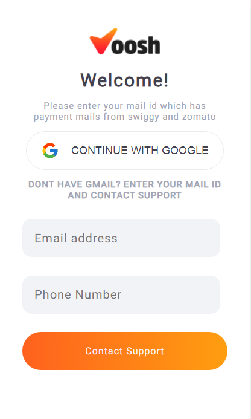
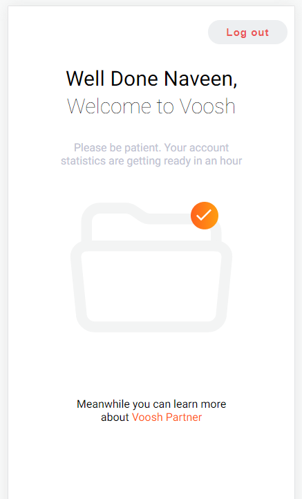
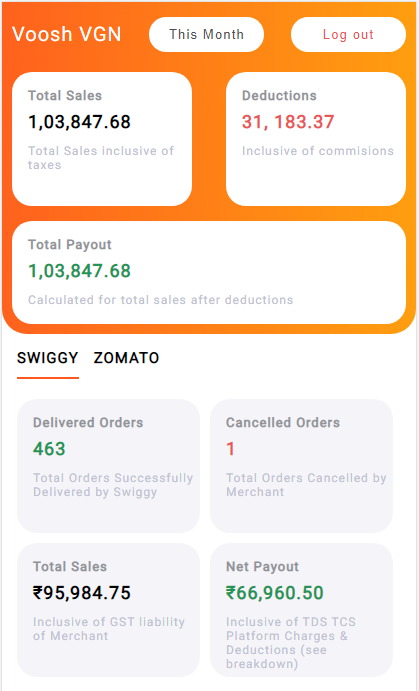
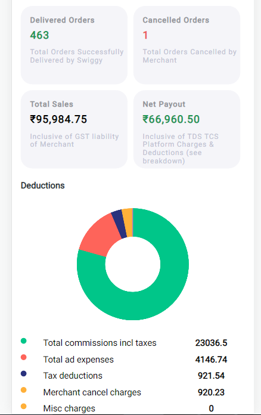
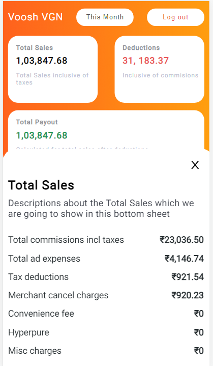

# Getting Started with Create React App

This project was bootstrapped with [Create React App](https://github.com/facebook/create-react-app).

## Available Scripts

In the project directory, you can run:

### `npm start`

Runs the app in the development mode.\
Open [http://localhost:3000](http://localhost:3000) to view it in the browser.

The page will reload if you make edits.\
You will also see any lint errors in the console.

### Kindly open this Application in Mobile screen as it is developed for Mobile screens only for Now.
- Sign In Page. Kindly click on Continue with Google for Next Page

    

- Please wait for 3 seconds for Dashboard Page

    

- Dashboard

        
    
- Please click on Top Total Sales card to see Total Sales Details

    
